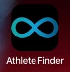
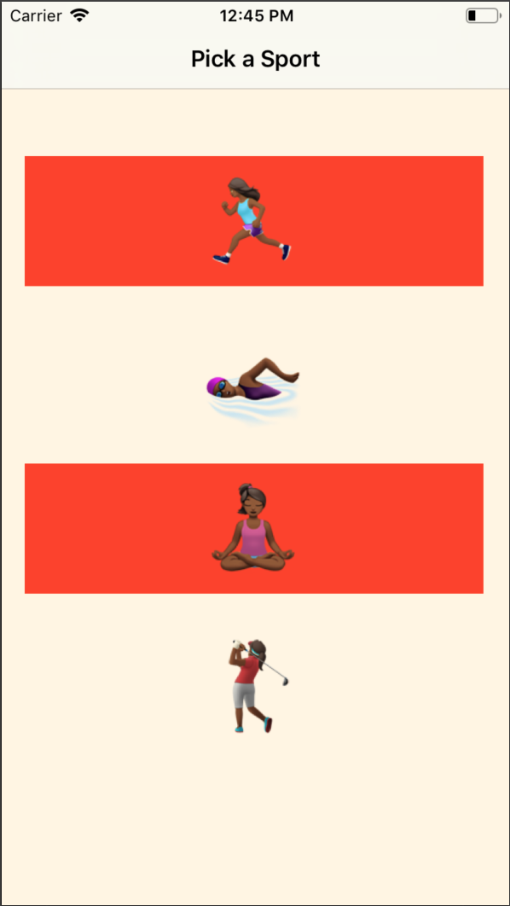
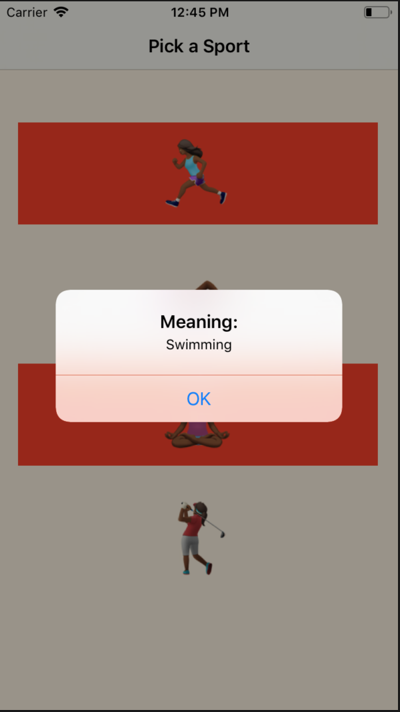
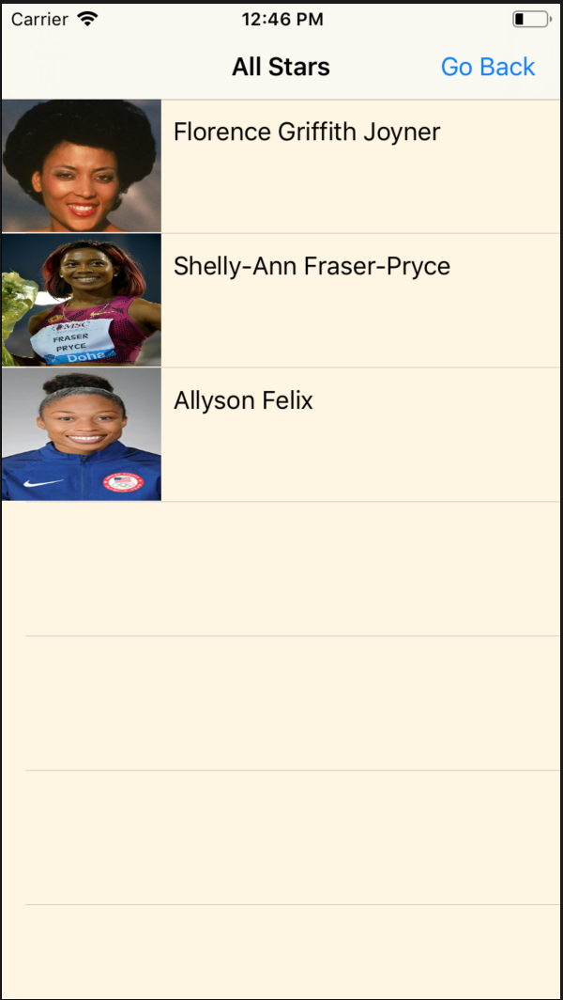

#Hack-a-Thing Septermber 2018

#Overview
We created an application that helps people find athletes of color in different fields with Swift.

#Who
Amara Gordon and Jolene Bernagene. We both went through the first tutorial, and Jolene came up with the athlete finder idea and continued developing it. Amara is working on a horoscope application that is not included in this iteration.

#Learned
Tutorials do not always provide you what you want, but they can be a great starting place. 
Also, because technology is always being updated there are syntax differences and layout differences that you have to figure out and work through as you go.

#What didn't work
We started trying to impliment a login system with Facebook but couldn't get it to work.

#Tutorials
We followed [Start Developing iOS Apps (Swift)](https://developer.apple.com/library/archive/referencelibrary/GettingStarted/DevelopiOSAppsSwift/PersistData.html#//apple_ref/doc/uid/TP40015214-CH14-SW1) and [AppCoda's Beginning iOS Programming with Swift](https://www.appcoda.com/learnswift/build-your-first-app.html).

#User Flow
###First Screen:

###Home Screen:

###Alert:

###Athletes:

